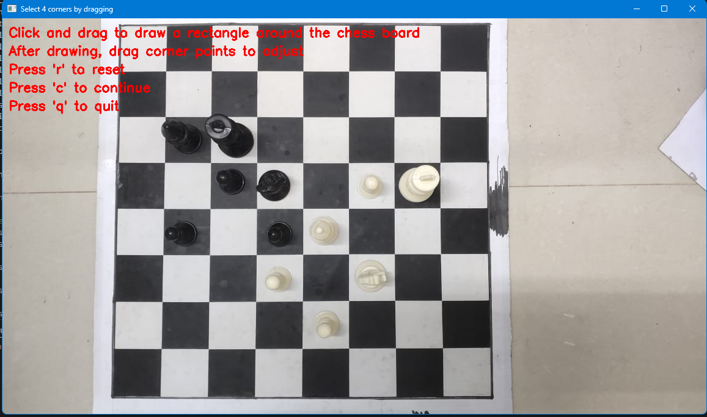
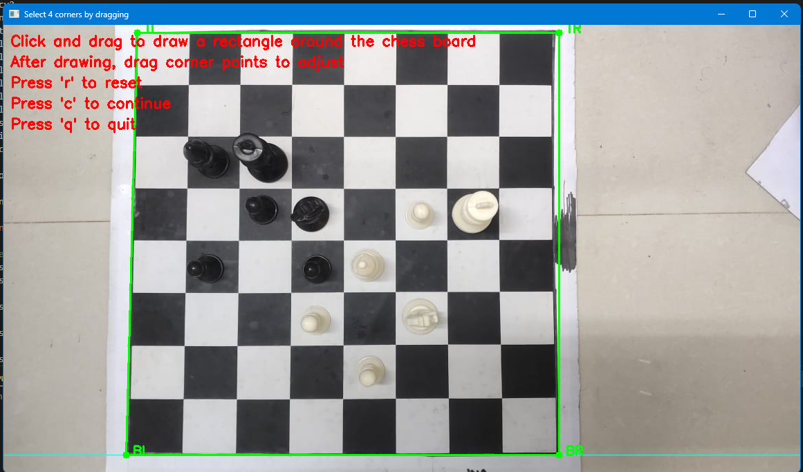
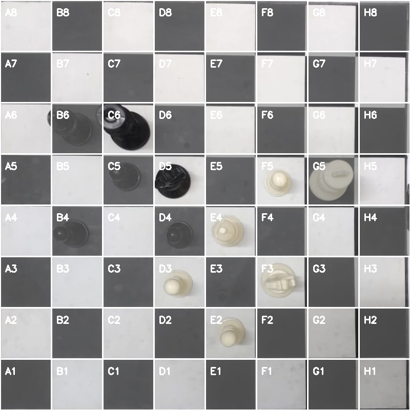
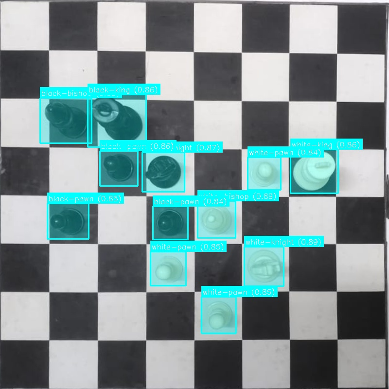
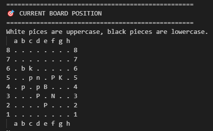

# Chessablanka

A computer vision-based chess position analyzer that can detect chess pieces from images and provide analysis.

## Features

- Upload any chess position image
- Automatic chessboard detection and perspective correction
- AI-powered chess piece recognition 
- Piece position detection with square coordinates (e.g. e4, f6)
- Chessablanka analysis showing:
  - Position evaluation
  - Best moves sequence
  - Best chess moves sequence line

## Showcase

### 1. Main Window
When you start the program, the main window appears where you can load your chess position image.



### 2. Manual Chessboard Selection
Select the four corners of the chessboard for accurate perspective correction.



### 3. Chess Grid Overlay
The program generates a perfect grid overlay on the corrected chessboard image.



### 4. Chess Piece Detection
AI-powered detection identifies each piece on the board.



### 5. Position Analysis
Displays detected pieces and their positions in a clear matrix format.




### 6. Move Analysis
Based on whose turn it is, Chessablanka provides detailed position evaluation and best moves.


Each step is automated and provides visual feedback to ensure accurate chess position analysis.

## Usage

### Installation

1. Clone the repository:
```bash
git clone https://github.com/yourusername/Chessablanka.git
cd Chessablanka
```

2. Install required packages:
```bash
pip install opencv-python numpy chess argparse
```

### Running the Program

Basic usage with default image:
```bash
python main.py
```

Specify custom image:
```bash 
python main.py --image path/to/chess/image.jpg
```

Example:
```bash
python main.py --image images/my_chess_position.jpg
```

## License

This project is licensed under MIT License - see the LICENSE file for details.

