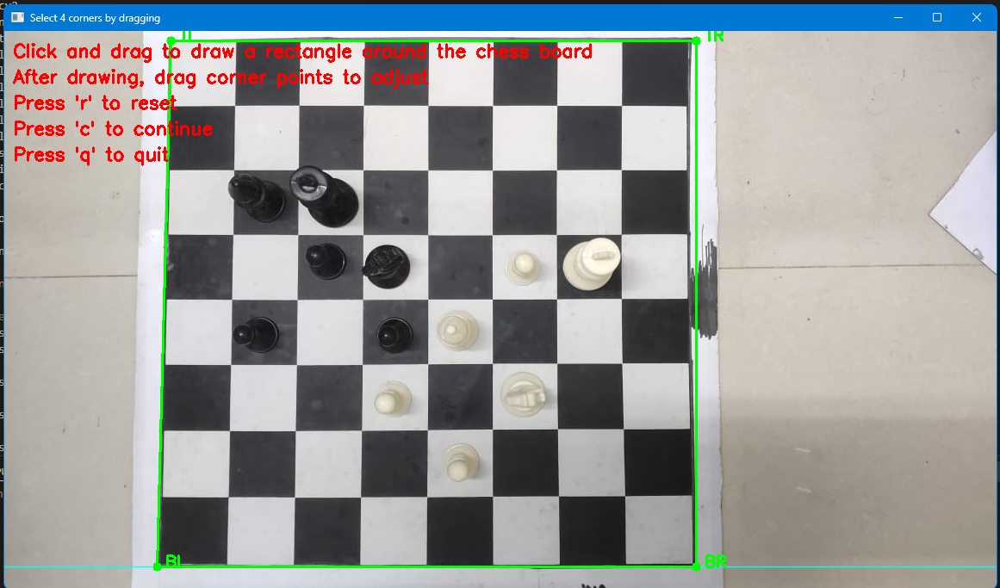
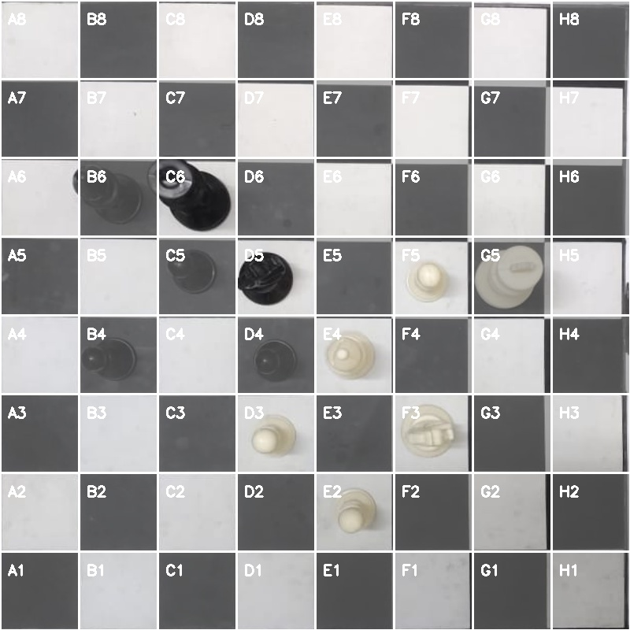
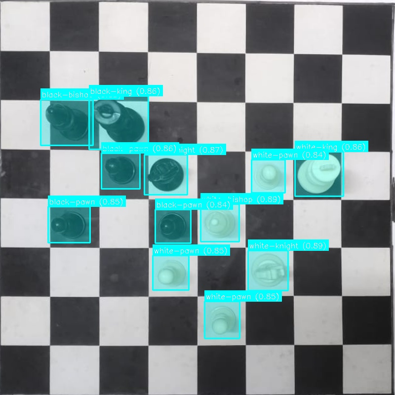
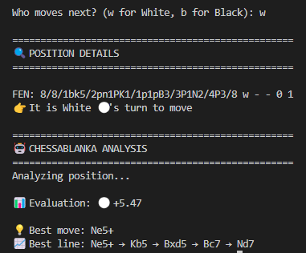

# Chessablanka

Chessablanka is a computer-vision chess position analyzer. It takes a chessboard image, reconstructs the board position, and evaluates the resulting game state with Stockfish.

## Highlights

- Load a chess-position image for analysis.
- Select the board corners and correct the image perspective.
- Generate an 8×8 grid over the corrected board.
- Detect chess pieces using a vision model.
- Map detected pieces to algebraic squares such as `e4` and `f6`.
- Generate a board position from the detected square map.
- Evaluate the position, best move, and principal variation with Stockfish.
- Save intermediate visual outputs for inspection.

## Analysis pipeline

```mermaid
flowchart LR
  IMAGE[Chessboard image] --> CORNERS[Board-corner selection]
  CORNERS --> WARP[Perspective correction]
  WARP --> GRID[8×8 grid mapping]
  GRID --> DETECT[Chess-piece detection]
  DETECT --> MAP[Piece-to-square mapping]
  MAP --> FEN[Position generation]
  FEN --> ENGINE[Stockfish analysis]
  ENGINE --> RESULT[Evaluation and best line]
```

## Built with

- Python
- OpenCV
- NumPy
- python-chess
- Roboflow vision model
- Stockfish
- Jupyter Notebook

## Screenshots

### Board selection

### Corrected board grid

### Piece detection

### Position evaluation

## Project status

Chessablanka is a local analysis tool. A public deployment URL has not been configured for this repository.

## License

This project is licensed under the [MIT License](LICENSE).

## Contact

Created by [Kedar Pravin Damale](https://github.com/KedarDamale).
